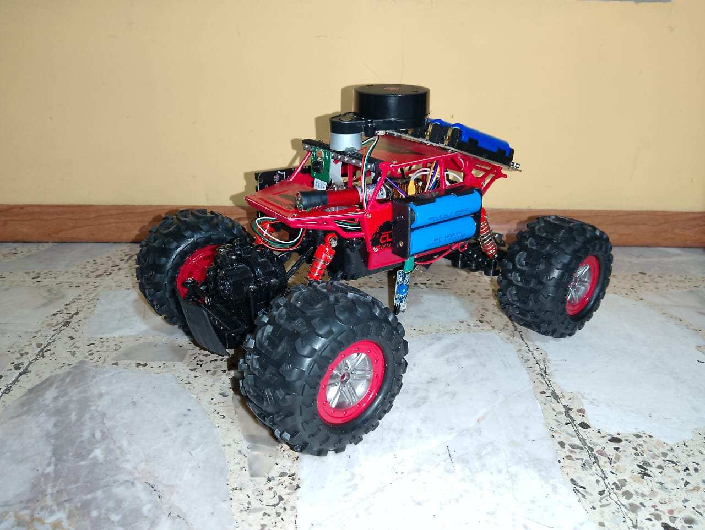

# 🚗 Vehiculo_Vision_Artificial

<p align="center">
  
</p>

Sistema de control para un vehículo miniatura diseñado para operar en entornos cerrados mediante visión artificial. Desarrollado en Python, integra procesamiento de imagen en tiempo real, seguimiento de líneas, control de velocidad mediante puente H, dirección por servomotor y una arquitectura basada en Raspberry Pi 4 con cámara CSI utilizando Picamera2 para la captura y análisis visual.

---

## 📌 ¿Qué hace este proyecto?

* Captura video en tiempo real desde la PiCamera.
* Procesa la imagen con OpenCV para detectar colores y formas.
* Toma decisiones de movimiento según lo detectado.
* Controla motores y dirección mediante GPIO.
* Muestra el video procesado en un servidor web local usando Flask.

---

## 🧩 Estructura del proyecto

```
Vehiculo_Vision_Artificial/
│
├── main.py          # Archivo principal
├── Vision_Cam.py    # Procesamiento de visión con Picamera2 y OpenCV
├── Control_GPIO.py  # Control de motores, dirección y seguidor de línea
├── templates/
│   └── index.html   # Interfaz web
├── static/
│   ├── style.css    # Estilos del servidor
│   └── ...
└── README.md
```

---

## 🖥️ Requisitos de hardware

* Raspberry Pi 4 (recomendado)
* Fuente de 5V – mínimo 2.5A
* Tarjeta microSD con Raspberry Pi OS
* Cámara CSI (PiCamera)
* Puente H para motores
* Motores DC
* Servomotor para dirección
* Sensores seguidor de línea

---

## 🧪 Sistema operativo

* Raspberry Pi OS (32 o 64 bits)
* Python 3

---

## ⚙️ Instalación de dependencias (solo lo necesario)

Actualizar sistema:

```bash
sudo apt update && sudo apt upgrade -y
```

Dependencias mínimas para OpenCV y video:

```bash
sudo apt install python3-opencv libatlas-base-dev libhdf5-dev libhdf5-serial-dev -y
sudo apt install ffmpeg libavcodec-dev libavformat-dev libswscale-dev -y
sudo apt install libgtk-3-0 -y
```

---

## 🐍 Entorno Python (opcional pero recomendado)

```bash
python3 -m venv venv
source venv/bin/activate
pip install --upgrade pip
pip install numpy opencv-python flask picamera2
```

---

## 📷 Configuración de cámara

### Cámara CSI con Picamera2 (modo principal)

1. Conectar la cámara al puerto CSI.
2. Activar la cámara:

```bash
sudo raspi-config
# Interfacing Options → Camera → Enable
sudo reboot
```

3. Uso en el proyecto:

El proyecto usa directamente Picamera2 desde `Vision_Cam.py`:

```python
from picamera2 import Picamera2
```

La captura se hace así:

```python
Im = Picamera2()
Im.configure(Im.create_preview_configuration(main={"format": 'XRGB8888', "size":(800,450)}))
Im.start()
frame = Im.capture_array()
```

> Se usa Picamera2 porque es la versión más estable y compatible con Raspberry Pi OS moderno.

---

## 🔮 Estructura lista para futura cámara USB

Aunque actualmente solo se usa cámara CSI, el proyecto está pensado para que en el futuro se pueda agregar soporte para cámara USB usando OpenCV:

```python
cap = cv2.VideoCapture(0)
ret, frame = cap.read()
```

La idea es que en el futuro se pueda elegir entre:

* Picamera2 (CSI)
* cv2.VideoCapture (USB)
  mediante una variable de configuración.

---

## ▶️ Ejecución del proyecto

Desde la carpeta del proyecto:

```bash
python3 main.py
```

Esto:

* Inicia los GPIO
* Inicia la cámara
* Levanta un servidor Flask

Luego abre en el navegador:

```
http://localhost:5000
```

---

## 🌐 ¿Qué ve el usuario?

Al ejecutar:

* Se crea un servidor web local.
* En el navegador se muestra:

  * Imagen de la cámara en tiempo real.
  * Información visual del procesamiento.
* En consola se muestran mensajes como:

  * Avanza
  * Detente
  * Gira a la izquierda/derecha
* El vehículo se mueve físicamente según la visión artificial y el seguidor de línea.

---

## 🔌 Pines GPIO usados

| Función          | GPIO |
| ---------------- | ---- |
| STBY puente H    | 23   |
| Motor ruedas     | 24   |
| Enable dirección | 17   |
| Dirección IN1    | 27   |
| Dirección IN2    | 22   |
| Sensor línea 1   | 5    |
| Sensor línea 2   | 6    |

Estos pines están definidos en `Control_GPIO.py` y deben respetarse o modificarse ahí si cambia el hardware.

---

## 📦 Librerías usadas en Python

* flask
* picamera2
* cv2 (OpenCV)
* numpy
* RPi.GPIO
* time

Además se usan:

* HTML y CSS para la interfaz web.

---

## 🛠️ Archivos principales

* `main.py` → Inicia cámara, GPIO y servidor web.
* `Vision_Cam.py` → Captura y procesamiento de imagen.
* `Control_GPIO.py` → Control de motores, dirección y seguidor de línea.
* `index.html` → Vista web.
* `style.css` → Estilos.

---

## 🧠 Notas importantes

* Se recomienda usar Picamera2 y no la versión antigua de picamera.
* No instalar dependencias innecesarias.
* Mantener Raspberry Pi OS actualizado.
* Revisar pines antes de alimentar motores.

---

## 👤 Autor

Ramiro A. Bustamante A.
Desarrollo de sistemas embebidos y visión artificial con Raspberry Pi
